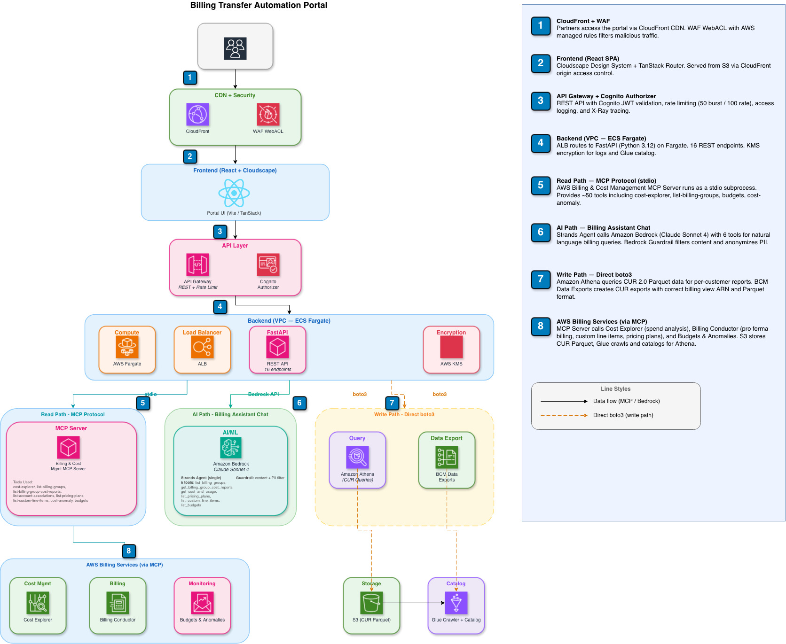

# Billing Transfer Automation Portal

An operational dashboard for AWS Distributors and Partners managing billing transfers across multiple downstream customers. Replaces manual AWS console workflows with automated tooling for margin analysis, credit visibility, CUR management, and pro forma gap remediation.

## The Problem

When an AWS Partner uses [Billing Transfer](https://docs.aws.amazon.com/awsaccountbilling/latest/aboutv2/orgs_transfer_billing.html) to manage a customer's consolidated bill, several operational challenges emerge:

1. **Credit Invisibility** — Bill-source accounts lose access to the Credits page and MAP 2.0 dashboard. Customers can't see how many credits they've used or what their balance is. (AWS Billing User Guide §334)

2. **Pro Forma Gaps** — Billing Conductor excludes support charges, credits, and refunds from the customer's Showback view by design. Partners must manually create Custom Line Items every month for every customer.

3. **CUR Breakage** — After billing transfer activation, existing Cost and Usage Report configurations go `UNHEALTHY`. Partners must manually reconfigure each one — entering a 113-column SQL query, selecting the correct billing view ARN, and disabling Split Cost Allocation.

4. **No Per-Customer Reports** — CUR files are multi-gigabyte Parquet files covering all customers. A distributor with 1000 customers can't download the raw file and filter in Excel.

5. **No Unified View** — Margin analysis requires cross-referencing My View and Showback data across multiple billing groups in separate console pages.

## Architecture



```
┌─────────────────────────────────────────────────────────────────────┐
│                        React Frontend (Vite)                        │
│  Cloudscape Design System · TanStack Router · TanStack Query        │
│  Tailwind CSS · OIDC Auth (Cognito)                                 │
├─────────────────────────────────────────────────────────────────────┤
│                        FastAPI Backend                               │
│  /dashboard · /transfer-dashboard · /billing-conductor              │
│  /finops · /gap-analysis · /credit-tracker                          │
│  /cur-manager · /customer-reports · /chat                           │
├──────────────────────────────────┬──────────────────────────────────┤
│   Direct AWS SDK (boto3)         │  Strands Agents + MCP Server     │
│                                  │  (Chat only — /chat endpoint)    │
│  · Billing Conductor API         │                                  │
│  · Cost Explorer API             │  · Amazon Bedrock (e.g. Claude  │
│  · BCM Data Exports API          │    Sonnet 4 / Amazon Nova Pro)   │
│  · Athena (CUR queries)          │    awslabs.billing-cost-         │
│  · S3 (CUR Parquet files)        │    management-mcp-server         │
│  · Glue (catalog/crawler)        │                                  │
│  · Budgets API                   │  MCP tools available to agent:   │
│  · DynamoDB (account registry)   │  · cost-explorer                 │
│  · STS (cross-account assume)    │  · list-billing-groups           │
│  Used by: all dashboard,         │  · cost-reports                  │
│  metrics, CUR, gap analysis,     │  · custom-line-items             │
│  credit tracker, and report      │  · cost-anomaly                  │
│  endpoints                       │  · budgets                       │
└──────────────────────────────────┴──────────────────────────────────┘
```

All dashboard, metrics, cost explorer, billing transfer, CUR management, and customer report endpoints use **boto3 directly** for both read and write operations. The `/chat` billing assistant uses [Strands Agents](https://strandsagents.com/) with the [AWS Billing & Cost Management MCP Server](https://awslabs.github.io/mcp/) spawned as a stdio subprocess, giving the AI agent access to billing tools via the Model Context Protocol.

### Multi-Account Support

The portal supports managing **multiple bill-receiver accounts** from a single deployment. A distributor with several billing transfer relationships across different AWS accounts can register each one and switch between them in the UI.

**How it works:**

1. The portal is deployed in a **central account** (the "portal account")
2. Each bill-receiver account gets a **cross-account IAM role** (`BillingPortalCrossAccountRole`) deployed via a CloudFormation template (`docs/cross-account-role.yaml`)
3. Account metadata is stored in a **DynamoDB table** in the portal account
4. When a user selects an account, the frontend sends an `x-account-id` header with each request
5. The backend uses **STS AssumeRole** to get temporary credentials for the target account (cached for 50 minutes)
6. All boto3 calls and MCP agent sessions use the assumed credentials transparently

**API endpoints:**

| Endpoint | Purpose |
|----------|---------|
| `GET /accounts` | List registered bill-receiver accounts |
| `POST /accounts` | Register a new account (account ID, name, role ARN) |
| `DELETE /accounts/{id}` | Remove an account |
| `POST /accounts/{id}/test` | Test cross-account connectivity |

**Setup:** Deploy the cross-account role in each target account:

```bash
aws cloudformation deploy \
  --template-file docs/cross-account-role.yaml \
  --stack-name billing-portal-cross-account \
  --parameter-overrides PortalAccountId=<portal-account-id> \
  --capabilities CAPABILITY_NAMED_IAM
```

Then register the account in the portal UI or via the API.

## Tech Stack

| Layer | Technology |
|-------|-----------|
| Frontend | React 19, Vite 7, Cloudscape Design System, TanStack Router + Query, Tailwind CSS 4 |
| Backend | Python 3.12, FastAPI, Pydantic |
| AI | Strands Agents, Amazon Bedrock (e.g. Claude Sonnet 4 / Amazon Nova Pro), MCP protocol |
| Infrastructure | AWS CDK (TypeScript), Nx 22 monorepo, pnpm |
| AWS Services | Billing Conductor, Cost Explorer, BCM Data Exports, Athena, S3, Glue, Cognito, DynamoDB |

## Tools & Frameworks

| Tool | Purpose |
|------|---------|
| **[Cloudscape Design System](https://cloudscape.design/)** | AWS open-source React UI components — consistent look and feel with the AWS Console |
| **[TanStack Router](https://tanstack.com/router)** | Type-safe file-based routing for the React SPA |
| **[TanStack Query](https://tanstack.com/query)** | Server state management — caching, refetching, and synchronization of API data |
| **[pnpm](https://pnpm.io/)** | Fast, disk-efficient Node.js package manager — used for all frontend and CDK dependencies |
| **[Nx](https://nx.dev/)** | Monorepo build orchestrator — manages build order, caching, and task dependencies across packages |
| **[@aws/nx-plugin](https://awslabs.github.io/nx-plugin-for-aws/)** | AWS-specific Nx generators and executors — scaffolds CDK, FastAPI, and React projects with best practices |
| **[@nxlv/python](https://www.npmjs.com/package/@nxlv/python)** | Nx plugin for Python projects — integrates UV, ruff, pytest into the Nx build pipeline |
| **[UV](https://docs.astral.sh/uv/)** | Fast Python package manager — manages virtual environments and dependencies for the backend |
| **[AWS CDK](https://aws.amazon.com/cdk/)** | Infrastructure as Code — defines all AWS resources (Fargate, API Gateway, Cognito, S3, Glue) in TypeScript |
| **[AppConfig (RuntimeConfig)](https://docs.aws.amazon.com/appconfig/)** | Delivers runtime configuration (API URLs, Cognito settings) to the frontend without rebuilding |
| **[Strands Agents](https://strandsagents.com/)** | AI agent framework — orchestrates the billing assistant's multi-agent chat system on Amazon Bedrock |
| **[MCP Protocol](https://modelcontextprotocol.io/)** | Model Context Protocol — connects the AI agents to AWS Billing & Cost Management APIs via stdio subprocess |
| **[Checkov](https://www.checkov.io/)** | Static analysis security scanner — validates CDK-generated CloudFormation against 1000+ security policies |
| **[Ruff](https://docs.astral.sh/ruff/)** | Fast Python linter and formatter — enforces code quality and security rules (including bandit checks) |
| **[Lambda Web Adapter](https://github.com/awslabs/aws-lambda-web-adapter)** | Enables running standard web frameworks (FastAPI) on AWS Lambda or ECS without code changes — used in the Fargate container |

## Features

### Dashboard (`/`)

Executive overview with KPIs (current month spend, pro forma revenue, margin, active transfers), billing group cards, monthly cost trend chart, and spend-by-service breakdown.

### Billing Transfer Overview (`/partner-dashboard`)

**Margin Analysis** — Per-account P&L comparing AWS Cost (My View) vs Pro Forma (Showback) with margin percentages. Grouped bar chart visualization.

**Pro Forma Coverage** — Health check per billing group: are support charges modeled? Credits modeled? CUR configured?

**Credit Tracker** — Solves the MAP 2.0 / credit invisibility problem. Shows per-billing-group credit amounts from the bill-transfer account's My View, which credits have been modeled as Billing Conductor CLIs, and which are still invisible to customers. One-click "Model as CLI" to create the Custom Line Item. Includes demo mode for simulated MAP credits.

**Financial Operations** — Credits applied, cost anomalies, active budgets with utilization alerts, 6-month margin trend.

**Pricing Configuration** — Billing Conductor pricing plans with expandable rules showing markup/discount percentages per service.

**Custom Line Items** — All recurring charges and credits applied via Billing Conductor.

### Pro Forma Gap Analysis (`/gap-analysis`)

**Margin Analysis** — Automated detection of support charges and credits in My View that aren't modeled in Showback. Coverage progress bar, per-billing-group gap details, and one-click fix with a review modal where the distributor can adjust names, descriptions, types, and amounts before creating Custom Line Items. Demo mode available.

**Reseller Commission** — Apply a standard percentage-based commission (5–25%) to selected billing groups. Creates a recurring FEE Custom Line Item in Billing Conductor using percentage-based pricing. Select billing groups from the table, pick a rate, and apply in one click.

### CUR Export Manager (`/cur-manager`)

One-click creation of Cost and Usage Report exports with the correct column list, billing view ARN, Split Cost Allocation disabled, and Parquet format. Health monitoring for existing exports. Batch "Create all missing exports" for billing groups without coverage.

### Customer Reports (`/customer-reports`)

Athena-powered per-customer CSV downloads from CUR 2.0 Parquet data. Searchable, paginated table of customer accounts per billing period. The server never loads raw data — Athena does the filtering, scaling to thousands of customers.

### Billing Assistant (`/chat`)

Natural language queries against real billing data. Floating chat widget on every page plus a full-page view. Three specialist Strands agents: Billing Cost (calls MCP tools), Transfer Billing Knowledge (AWS docs), and AWS Knowledge (general).

## Projects

| Project | Path | Description |
|---------|------|-------------|
| `@billing-partner-portal/portal-website` | `packages/portal-website` | React frontend (Cloudscape, TanStack Router, Cognito auth) |
| `billing_partner_portal.billing_api` | `packages/billing_api` | FastAPI backend (MCP tools, boto3, Athena) |
| `billing_partner_portal.agents` | `packages/agents` | Strands multi-agent orchestrator (Bedrock) |
| `@billing-partner-portal/infra` | `packages/infra` | AWS CDK infrastructure |
| `@billing-partner-portal/common-constructs` | `packages/common/constructs` | Shared CDK constructs |

## Getting Started

### Prerequisites

- [Node.js >= 20](https://nodejs.org/en/download) (we recommend [NVM](https://github.com/nvm-sh/nvm))
- [pnpm >= 9](https://pnpm.io/installation#using-npm)
- [Python >= 3.12](https://www.python.org/downloads/) and [UV](https://docs.astral.sh/uv/getting-started/installation/)
- [Docker](https://www.docker.com/) — required for building the Fargate container image during CDK deploy
- [AWS CLI v2](https://docs.aws.amazon.com/cli/latest/userguide/getting-started-install.html) configured with credentials for your **bill-receiver account**
- [Amazon Bedrock model access](https://console.aws.amazon.com/bedrock/home#/modelaccess) — enable Claude Sonnet 4 or Amazon Nova Pro in your deployment region

#### AWS Permissions

CDK deployment requires **Administrator access** (or PowerUserAccess + IAM full access) on the bill-receiver account. This is needed to create VPC, ECS Fargate, API Gateway, Cognito, S3, Glue, KMS, CloudFront, WAF, IAM roles, and CloudWatch resources. This is standard for CDK-based deployments — the CDK bootstrap process itself requires Admin.

After deployment, the application uses least-privilege IAM roles created by CDK:
- **Fargate task role** — read-only billing APIs + Athena/Glue/S3/Bedrock write access
- **Glue crawler role** — S3 read + Glue service + KMS encryption

> **Note:** You only need credentials for your bill-receiver (distributor) account. No downstream customer account IDs or permissions are needed — the portal discovers all billing groups and member accounts automatically via the Billing Conductor API.

### Deployment

#### Step 1: Install Dependencies

```bash
git clone <repository-url>
cd sample-billing-transfer-workflow-automation
pnpm install
uv sync
```

#### Step 2: Configure Environment

```bash
pnpm configure
```

The interactive setup prompts for your AWS profile, region, and Bedrock model — auto-detecting values where possible. It generates a `.env` file for local development. The deployed application gets all configuration from CDK.

#### Step 3: Build

```bash
pnpm nx run-many --target build --all
```

#### Step 4: Bootstrap CDK (First Time Only)

```bash
AWS_PROFILE=your-billing-profile pnpm nx run @billing-partner-portal/infra:bootstrap
```

#### Step 5: Deploy Infrastructure

```bash
AWS_PROFILE=your-billing-profile pnpm nx run @billing-partner-portal/infra:deploy
```

If you have existing legacy CUR data in another S3 bucket, include it:

```bash
LEGACY_CUR_S3_PATH=s3://your-existing-cur-bucket/path/to/parquet/ \
  AWS_PROFILE=your-billing-profile pnpm nx run @billing-partner-portal/infra:deploy
```

This deploys all infrastructure with proper IAM roles and permissions:

| Resource | Purpose |
|----------|---------|
| **VPC + ECS Fargate** | FastAPI backend container with MCP subprocess support |
| **Application Load Balancer** | Routes traffic to Fargate |
| **API Gateway + Cognito** | HTTPS endpoint with user authentication |
| **CloudFront + S3** | React frontend hosting (SPA) |
| **Bedrock Guardrail** | Content filtering for the billing assistant |
| **S3 buckets** | CUR data storage + Athena query results (with BCM Data Exports write policy) |
| **Glue database + crawler** | Auto-catalogs CUR Parquet data for Athena (with KMS encryption) |
| **KMS keys** | Encryption for Glue CloudWatch logs and job bookmarks |
| **DynamoDB table** | Multi-account registry (stores registered bill-receiver account metadata) |
| **IAM roles** | Fargate task role (billing, cost explorer, Athena, Bedrock, S3, Glue, DynamoDB), Crawler role (S3 read, Glue, KMS, CloudWatch) |

#### Step 6: Create Users

Users are managed via Cognito (self-signup is disabled for security):

```bash
aws cognito-idp admin-create-user \
  --user-pool-id <UserPoolId from deploy output> \
  --username admin \
  --temporary-password 'TempPass123!' \
  --user-attributes Name=email,Value=your@email.com Name=email_verified,Value=true
```

Then sign in at the CloudFront URL from the deploy output and set a permanent password.

#### Step 7: Create CUR Exports and Run Crawler

All done from the portal UI — no console or CLI needed:

1. Open the portal → **CUR Export Manager** (`/cur-manager`)
2. Click **"Create all missing exports"** — creates CUR 2.0 exports for each billing group
3. Wait for data to arrive in S3 (typically a few hours for the first delivery)
4. Click **"Run crawler"** — catalogs the data so Athena can query it
5. **Customer Reports** (`/customer-reports`) will show per-customer billing data

> The Athena table name is auto-discovered from the Glue catalog — no manual configuration needed.

### Deploy via EC2 (no local toolchain required)

If you cannot install Node.js, Python, or Docker locally (e.g. locked-down corporate laptop), deploy from a temporary EC2 instance instead. A CloudFormation template is provided.

#### Step 1: Upload zip to S3

1. Go to **S3** in AWS Console → **Create bucket** (any name, e.g. `deploy-temp`)
2. Upload the `sample-billing-transfer-workflow-automation.zip` file to that bucket

#### Step 2: Launch deploy instance

1. Go to **CloudFormation → Create stack → Upload a template file**
2. Select `docs/deploy-instance.yaml` from the zip
3. Stack name: `deploy-instance`
4. Parameter `S3ZipPath`: enter `s3://YOUR-BUCKET/sample-billing-transfer-workflow-automation.zip`
5. Acknowledge IAM resource creation → Submit
6. Wait ~3 minutes for CREATE_COMPLETE

#### Step 3: Connect and deploy

1. Go to **EC2 → Instances** → select `billing-portal-deploy` → **Connect → Session Manager → Connect**
2. Run:

```bash
sudo su - ec2-user
cd ~/sample-billing-transfer-worflow-automation

# Remove empty AWS_PROFILE (EC2 uses instance role automatically)
node -e "const f='.env';let c=require('fs').readFileSync(f,'utf8');c=c.replace(/^AWS_PROFILE=.*\n?/gm,'');require('fs').writeFileSync(f,c)"

pnpm install
pnpm configure          # Accept defaults, leave AWS_PROFILE blank
node -e "const f='.env';let c=require('fs').readFileSync(f,'utf8');c=c.replace(/^AWS_PROFILE=.*\n?/gm,'');require('fs').writeFileSync(f,c)"

pnpm nx run-many --target build --all
pnpm nx run @billing-partner-portal/infra:deploy
```

#### Step 4: Create login user

Replace values from the deploy output:

```bash
aws cognito-idp admin-create-user \
  --user-pool-id <UserPoolId> \
  --username admin \
  --temporary-password 'TempPass123!' \
  --message-action SUPPRESS

aws cognito-idp admin-set-user-password \
  --user-pool-id <UserPoolId> \
  --username admin \
  --password 'YourSecurePassword!' \
  --permanent

aws cognito-idp update-user-pool-client \
  --user-pool-id <UserPoolId> \
  --client-id <ClientId> \
  --callback-urls "https://<CloudFrontDomain>" "http://localhost:4200" \
  --logout-urls "https://<CloudFrontDomain>" "http://localhost:4200" \
  --supported-identity-providers COGNITO \
  --allowed-o-auth-flows code \
  --allowed-o-auth-scopes email openid profile \
  --allowed-o-auth-flows-user-pool-client
```

#### Step 5: Access the portal

Open `https://<CloudFrontDomain>` in any browser and sign in.

#### Step 6: Clean up deploy resources

The portal runs on Fargate — the EC2 is no longer needed:

1. **CloudFormation** → delete `deploy-instance` stack
2. **S3** → empty and delete the temp bucket

---

### Local Development

Run the application locally against your AWS account. Requires AWS CLI credentials configured for the bill-receiver account.

#### Additional Prerequisites

- [Docker](https://www.docker.com/) — required for CDK deployment (builds the Fargate container image)

#### Start the Application

```bash
pnpm nx run @billing-partner-portal/portal-website:serve-local --skip-nx-cache
```

This starts both the backend and frontend together:

| Service | URL |
|---|---|
| Frontend | http://localhost:4200 |
| Backend API | http://localhost:8000 |

Verify the backend is running: http://localhost:8000/echo?message=hello

#### Frontend Only (Against Deployed APIs)

```bash
pnpm nx run @billing-partner-portal/portal-website:serve
```

#### Backend Only

```bash
cd packages/billing_api
uv run fastapi dev billing_partner_portal_billing_api/main.py --port 8000
```

#### Load Runtime Config (After Deployment)

Download Cognito and API config for local auth:

```bash
pnpm nx run @billing-partner-portal/portal-website:load:runtime-config
```

## Build & Test

```bash
# Build everything
pnpm nx run-many --target build --all

# Test everything
pnpm nx run-many --target test --all

# Lint and fix
pnpm nx run-many --target lint --configuration=fix --all
```

## Infrastructure Targets

```bash
# Synthesize CloudFormation
pnpm nx run @billing-partner-portal/infra:synth

# Deploy
pnpm nx run @billing-partner-portal/infra:deploy

# Destroy
pnpm nx run @billing-partner-portal/infra:destroy

# Run Checkov security scan
pnpm nx run @billing-partner-portal/infra:checkov
```

## API Targets

```bash
# Generate OpenAPI spec
pnpm nx run billing_partner_portal.billing_api:openapi

# Run backend tests
pnpm nx run billing_partner_portal.billing_api:test

# Serve backend locally
pnpm nx run billing_partner_portal.billing_api:serve
```

## Documentation

- [IAM Roles & Policies](docs/IAM_ROLES_AND_POLICIES.md)
- [CUR Export Manager Technical Docs](docs/CUR_EXPORT_MANAGER.md)
- [AWS Billing Transfer Documentation](https://docs.aws.amazon.com/awsaccountbilling/latest/aboutv2/orgs_transfer_billing.html)

## Production Recommendations

The following are recommended for production deployments but not enforced by default:

| Recommendation | How to Enable |
|---------------|---------------|
| **CloudTrail logging** | Enable CloudTrail in your account to audit all API calls. This is an account-level setting, not application-specific. |
| **Bedrock invocation logging** | Enable in the [Bedrock console](https://console.aws.amazon.com/bedrock/home#/settings) → Settings → Invocation logging → S3 or CloudWatch. |
| **Custom domain + TLS 1.2** | Attach an ACM certificate to CloudFront and set `minimumProtocolVersion: TLS_V1_2_2021`. Requires a Route 53 hosted zone or external DNS. |
| **Remove localhost callback URLs** | For production-only deployments, remove `http://localhost:*` from the Cognito callback URLs in `packages/common/constructs/src/core/user-identity.ts`. These are included for local development. |
| **CloudWatch alarms** | Add alarms for Fargate CPU/memory, API Gateway 5xx errors, and ALB unhealthy targets. |
| **WAF rate limiting** | The portal includes a WAF WebACL on CloudFront. Add rate-based rules for additional DDoS protection. |
